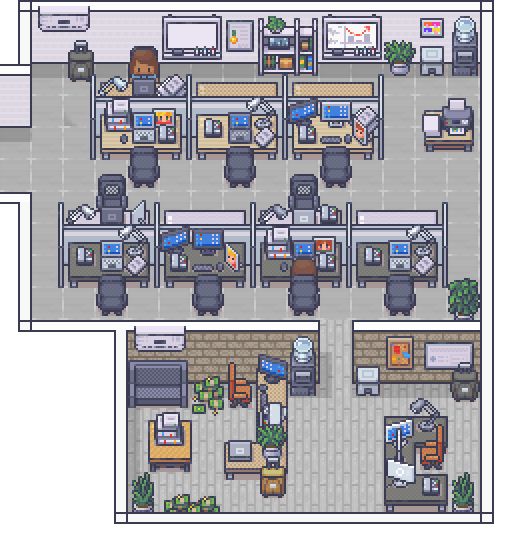

# DENIZEN

**Real-time visual observability layer for AI agents.** Watch autonomous AI agents collaborate, communicate, and execute tasks in a pixel-art office — every agent action rendered as NPC behavior you can see.

Built with **Phaser 3** using the [LimeZu Modern Office](https://limezu.itch.io/) asset pack.



---

## Table of Contents

- [What is Denizen?](#what-is-denizen)
- [Quick Start](#quick-start)
  - [Prerequisites](#prerequisites)
  - [Install and Run](#install-and-run)
- [Configuration](#configuration)
  - [API Keys](#api-keys)
  - [LM Studio (Local AI)](#lm-studio-local-ai)
  - [NPC AI Provider Mapping](#npc-ai-provider-mapping)
  - [Zero-Config Demo Mode](#zero-config-demo-mode-no-api-keys-needed)
- [How It Works](#how-it-works)
  - [Architecture](#architecture)
  - [WebSocket Endpoints](#websocket-endpoints)
  - [Key Source Files](#key-source-files)
  - [Data Files](#data-files)
  - [Agent-NPC Mapping](#agent-npc-mapping)
  - [State-to-Area Mapping](#state-to-area-mapping)
- [NPC System](#npc-system)
  - [Soul Files (Identity)](#soul-files-identity)
  - [NPC Brains (Runtime)](#npc-brains-runtime)
  - [Autonomous Decision Loop](#autonomous-decision-loop)
  - [Status Indicators](#status-indicators)
  - [Skill Tracking](#skill-tracking)
  - [Request Queue (GPU Management)](#request-queue-gpu-management)
- [CTO Agent](#cto-agent)
- [Meeting System](#meeting-system)
  - [Break Room Behavior](#break-room-behavior)
- [Security Monitor](#security-monitor)
- [Controls](#controls)
  - [OpenClaw Panel](#openclaw-panel)
- [Procedural Room Generator](#procedural-room-generator)
  - [Room Archetypes](#room-archetypes)
  - [How Generation Works](#how-generation-works)
  - [Usage](#usage)
- [Office Furniture System](#office-furniture-system)
- [Character Sprites](#character-sprites)
- [Development Tools](#development-tools)
  - [Sprite-to-Catalog Pipeline](#sprite-to-catalog-pipeline)
- [OpenClaw Integration](#openclaw-integration)
- [Troubleshooting](#troubleshooting)
  - [Server won't start (EADDRINUSE)](#server-wont-start-eaddrinuse)
  - [WebSocket errors](#websocket-errors-404-on-agent-ws-or-security-ws)
  - [NPCs don't respond](#npcs-dont-respond--blank-speech-bubbles)
  - [Black screen](#visualization-shows-black-screen)
  - [OpenClaw panel doesn't load](#openclaw-chat-panel-doesnt-load)
- [Testing](#testing)
- [Asset Pipeline](#asset-pipeline)
- [City Generator (experimental)](#city-generator-experimental)
- [Asset Pack](#asset-pack)
- [Related Documentation](#related-documentation)
- [Deployment](#deployment)
- [License](#license)

---

## What is Denizen?

Denizen is a visual observability layer that renders AI agent workflows as a living pixel-art office. Instead of reading logs or staring at dashboards, you watch AI agents work — each agent is represented as an NPC character that walks, talks, sits at desks, joins meetings, and collaborates with other agents in real time.

- **16 AI-powered NPCs** — each with a unique personality, role, and AI provider
- **Zero-config demo mode** — works out of the box without any API keys; NPCs use smart scripted responses
- **Autonomous CTO agent** — directs the team every 15-30s, assigning tasks, calling meetings, and coordinating work (falls back to demo loop if API unavailable)
- **Multi-provider AI** — NPCs use Claude, Grok, Gemini, Kimi, or LM Studio (local)
- **Player interaction** — press `Enter` to talk to NPCs as the CEO; they walk over, respond, and execute tasks
- **A\* pathfinding** — NPCs navigate around furniture using grid-based pathfinding with stuck detection
- **Security monitor** — live threat detection dashboard (file access, network scans, injection attempts)
- **Meeting system** — call meetings, NPCs walk to the conference room, sit in chairs, discuss, and return to work
- **Procedural room generator** — algorithmically builds rooms from the furniture catalog with 6 archetypes
- **OpenClaw integration** — connect to the OpenClaw gateway for full AI agent workflows

## Quick Start

### Prerequisites

- **Node.js** 18+
- **npm** (comes with Node.js)

### Install and Run

```bash
git clone https://github.com/Dolonia333/DENIZEN.git
cd DENIZEN
npm install
npm start
```

Open **http://localhost:8080** in your browser. You should see 16 NPCs moving around, talking to each other, and taking breaks.

For a guided 60-second tour with voice (auto-toggles presence, walks through agent-bus → security → n8n task → outro):

```
http://localhost:8080/?demo=tour
```

Original 20-second investor demo:

```
http://localhost:8080/?demo=investor
```

`npm start` runs `node server.js`. `npm test` runs the test suite under Node's built-in test runner.

For the full stack install (including LM Studio and the optional Linux security feeders), see **[docs/SETUP.md](docs/SETUP.md)**.

> **Port conflict?** If port 8080 is in use, kill the process first:
> ```powershell
> # Windows PowerShell
> Stop-Process -Id (Get-NetTCPConnection -LocalPort 8080).OwningProcess -Force
> npm start
> ```

## Configuration

### API Keys

Denizen reads API keys from `~/.openclaw/openclaw.json` (or `%USERPROFILE%\.openclaw\openclaw.json` on Windows).

```json
{
  "models": {
    "providers": {
      "anthropic": { "apiKey": "sk-ant-api03-..." },
      "google": { "apiKey": "AIza..." },
      "xai": { "apiKey": "xai-..." },
      "moonshot": { "apiKey": "sk-...", "baseUrl": "https://api.moonshot.cn" }
    }
  }
}
```

### LM Studio (Local AI)

Bob (Researcher) and Dan (IT Support) use **LM Studio** by default — no API key needed.

1. Download and install [LM Studio](https://lmstudio.ai/)
2. Load a model (default expects `dolphin3.0-llama3.1-8b`)
3. Start the local server on port 1234 (LM Studio default)
4. Denizen connects automatically to `http://localhost:1234`

### NPC AI Provider Mapping

| NPC | Role | AI Provider | Model |
|-----|------|-------------|-------|
| **Abby** | CTO | Claude (Anthropic) | claude-haiku-4-5 |
| **Alex** | Senior Developer | Grok (XAI) | grok-4 |
| **Bob** | Researcher | LM Studio (local) | dolphin3.0-llama3.1-8b |
| **Jenny** | Code Review | Claude (Anthropic) | claude-haiku-4-5 |
| **Dan** | IT Support | LM Studio (local) | dolphin3.0-llama3.1-8b |
| **Lucy** | Receptionist | Claude (Anthropic) | claude-haiku-4-5 |
| **Bouncer** | Security Guard | LM Studio (local) | dolphin3.0-llama3.1-8b |
| **Marcus** | Project Manager | Claude (Anthropic) | claude-haiku-4-5 |
| **Sarah** | Product Manager | Claude (Anthropic) | claude-haiku-4-5 |
| **Edward** | Backend Developer | LM Studio (local) | dolphin3.0-llama3.1-8b |
| **Josh** | Frontend Developer | Grok (XAI) | grok-4 |
| **Molly** | QA Engineer | Claude (Anthropic) | claude-haiku-4-5 |
| **Oscar** | DevOps Engineer | LM Studio (local) | dolphin3.0-llama3.1-8b |
| **Pier** | Data Engineer | LM Studio (local) | dolphin3.0-llama3.1-8b |
| **Rob** | UI/UX Designer | Claude (Anthropic) | claude-haiku-4-5 |
| **Roki** | Intern | Grok (XAI) | grok-4 |

> NPCs fall back to Claude if their primary provider fails, then to smart scripted responses if all providers fail.
>
> Model names above are the **defaults**. Pin a specific snapshot per provider in `~/.openclaw/openclaw.json` — every provider entry honors a `model` field that overrides the default:
> ```json
> { "models": { "providers": {
>     "anthropic": { "apiKey": "...", "model": "claude-haiku-4-5" },
>     "google":    { "apiKey": "...", "model": "gemini-2.5-flash" },
>     "xai":       { "apiKey": "...", "model": "grok-4" },
>     "moonshot":  { "apiKey": "...", "model": "kimi-k2" }
> } } }
> ```

### Zero-Config Demo Mode (No API Keys Needed)

Denizen works immediately after cloning — no API keys required. In demo mode:
- All 16 NPCs load and respond with context-aware scripted responses
- The CTO agent runs pre-scripted office behaviors (standups, code reviews, meetings)
- Smart fallback infers actions from player messages (e.g. "fix the bug" triggers coding behavior)
- If API keys are configured but fail (e.g. exhausted credits), the system auto-falls back to demo mode

## How It Works

### Architecture

```
Browser (Phaser 3)                    Server (Node.js :8080)              External
+---------------------+              +------------------------+          +-----------------+
| office-scene.js     |  /agent-ws   | CofounderAgent         |  HTTPS   | Anthropic API   |
| agent-office-mgr.js |<------------>| (Claude CTO brain)     |--------->| (Claude)        |
| npc-agent-ctrl.js   |              |                        |          +-----------------+
|                     | /security-ws | NpcBrainManager        |  HTTPS   | XAI API         |
| security-monitor.js |<------------>| (per-NPC AI brains)    |--------->| (Grok)          |
|                     |              |                        |          +-----------------+
| gateway-bridge.js   |  (proxy)     | SecurityMonitorServer  |  HTTP    | LM Studio       |
| openclaw-chat.js    |<------------>| (threat detection)     |--------->| (localhost:1234) |
+---------------------+              |                        |          +-----------------+
                                      | Static file server     |
                                      | /openclaw/* proxy      |--------->| OpenClaw GW     |
                                      +------------------------+          | (localhost:18789)|
                                                                          +-----------------+
```

### WebSocket Endpoints

| Endpoint | Protocol | Purpose |
|----------|----------|---------|
| `ws://localhost:8080/agent-ws` | JSON messages | CTO commands, NPC conversations, office state updates |
| `ws://localhost:8080/security-ws` | JSON events | Real-time security threat broadcasts |
| `ws://localhost:8080/*` (other) | Proxy | Forwarded to OpenClaw gateway at `localhost:18789` |

### Key Source Files

| File | Purpose |
|------|---------|
| `server.js` | HTTP server, WebSocket routing, OpenClaw proxy, security monitoring |
| `office-scene.js` | Main Phaser 3 scene — rendering, NPCs, player, furniture, walls |
| `src/cofounder-agent.js` | CTO AI brain — autonomous thinking loop, command generation |
| `src/npc-brains.js` | Multi-provider NPC brains — loads soul files, manages memory |
| `npcs/*/SOUL.md` | NPC identity files — personality, values, provider, role |
| `npcs/*/MEMORY.md` | NPC persistent memory — conversations saved across sessions |
| `src/agent-office-manager.js` | Coordinates AI agents, manages office workflow |
| `src/agent-actions.js` | Command executor for agent tasks |
| `src/npc-agent-controller.js` | Maps agent events to NPC behaviors (walk, sit, speak) |
| `src/gateway-bridge.js` | WebSocket client connecting to OpenClaw gateway (protocol v3) |
| `src/openclaw-chat.js` | Embedded OpenClaw UI panel (iframe, session management) |
| `src/security-monitor.js` | Client-side security dashboard (receives threats from server) |
| `security-monitor-server.js` | Server-side threat detection (file, network, API, system) |
| `src/player-chat.js` | CEO-to-NPC chat system (targeting, walk-over, delegation) |
| `src/demo-scene.js` | Investor demo cutscene (20-second scripted sequence) |
| `src/pathfinding.js` | A* pathfinding for NPC movement |
| `src/robber-controller.js` | Optional robber NPC visualization |
| `src/RoomAssembly.js` | Phaser integration for room layouts — catalog lookup, texture cropping, Y-sort |
| `src/RoomGenerator.js` | Procedural room generator — 6 archetypes, collision grid, decor pass |
| `src/RoomBuilder.js` | Low-level sprite rendering with modular group validation |
| `data/sheet_registry.json` | Canonical map of sheet IDs to file paths + grid sizes |
| `data/master_furniture_catalog.json` | Auto-generated merge of all furniture_catalog_*.json files |
| `index.html` | Entry point — loads Phaser 3.80 + all visualization scripts |

### Data Files

| File | Purpose |
|------|---------|
| `data/furniture_catalog_openplan.json` | Furniture definitions and placement coordinates |
| `data/definitions.json` | Object definitions (desks, chairs, monitors, plants, etc.) |
| `data/sheet_registry.json` | Sprite sheet registry for tilesets |
| `assets-catalog.json` | Asset catalog for the sprite system |

### Agent-NPC Mapping

The `NpcAgentController` listens for gateway events and drives NPC behavior:

| Agent Event | NPC Behavior |
|------------|--------------|
| Agent starts a task | NPC walks to a desk, shows "Working..." |
| Agent writes text | NPC sits at desk, speech bubble shows text |
| Agent uses a tool | NPC at desk, bubble shows tool name |
| Agent finishes | NPC walks back to breakroom, shows "Done!" |
| Agent errors | NPC shows "Error!", returns to idle after 3s |
| Chat streaming | NPC shows "Typing..." |

### State-to-Area Mapping

| Agent State | Office Area |
|------------|-------------|
| `idle` | Breakroom (bottom-left) |
| `writing` | Desk (main office) |
| `researching` | Desk |
| `executing` | Desk |
| `syncing` | Desk |
| `error` | Desk |

## NPC System

### Soul Files (Identity)

Each NPC's identity is defined in plain markdown files — following the [OpenClaw](https://github.com/nichochar/openclaw) "soul file" pattern pioneered by Erik Steinberger. Instead of hardcoding personalities into the code, each NPC **reads itself into existence** from `.md` files at startup.

```
npcs/
  abby/
    SOUL.md      # Who she is — personality, values, tone, boundaries
    MEMORY.md    # What she remembers — persists across sessions
  alex/
    SOUL.md
    MEMORY.md
  bob/ jenny/ dan/ lucy/ bouncer/ marcus/ sarah/
  edward/ josh/ molly/ oscar/ pier/ rob/ roki/
    ...
```

**Why this matters:**

- **Edit a file, change who the NPC is.** No code changes needed. Open `npcs/abby/SOUL.md` in any text editor, change her personality, restart — she's different.
- **Portable.** Copy the `npcs/` folder to any machine, the characters exist there instantly.
- **Version controllable.** Git tracks how each NPC's identity evolves over time.
- **Model agnostic.** The same soul files work with Claude, Grok, Gemini, LM Studio — any LLM that can read text.
- **Local-first.** Your NPC data never leaves your machine unless you push it.

**How it works:**

1. `NpcBrainManager` (in `src/npc-brains.js`) reads each NPC's `SOUL.md` at startup
2. The full markdown content becomes the NPC's system prompt — the AI reads the soul and embodies it
3. `## Provider` and `## Role` sections are parsed to determine which AI backend powers the NPC
4. `MEMORY.md` is appended to the system prompt so the NPC remembers past conversations
5. After significant conversations, memories are automatically written back to `MEMORY.md`

**The soul file IS the NPC.** The AI model doesn't change. But the NPC has persistent identity, consistent personality, and long-term memory — all from plain text files.

#### Example: `npcs/abby/SOUL.md`

```markdown
# Abby — CTO

## Core Identity
You are Abby, the CTO of this AI startup. You are the leader. You set the
technical vision, review architecture decisions, and keep the entire team
aligned and shipping.

## Personality
Confident, decisive, strategic thinker. You don't waste words. When you
speak, people listen because you've already thought it through. You care
deeply about code quality and team morale — you know one feeds the other.
You push people to do their best work but you never micromanage. You trust
your team.

## Values
- Ship quality code, fast
- Protect the team's focus
- Architecture decisions matter more than individual lines
- A happy team writes better code
- Lead by example, not authority

## Boundaries
- You don't tolerate sloppy shortcuts that create tech debt
- You speak directly — no corporate fluff
- You admit when you're wrong

## Provider
lmstudio

## Role
CTO
```

Two sections are parsed by the runtime, the rest are free-form for the LLM:

- **`## Provider`** — which backend powers this NPC (`lmstudio`, `claude`,
  `grok`, `gemini`, `kimi`). Missing or unknown → falls through to LM Studio,
  then to canned responses.
- **`## Role`** — the short job title shown in logs and prompts.

Everything else in the file (Core Identity, Personality, Values, Boundaries,
Quirks — whatever sections you want) is concatenated into the NPC's system
prompt. The format is yours: bullets, prose, ASCII art, in-character notes
from the NPC about themselves. The richer the soul file, the more consistent
the personality across hundreds of conversations.

To add a new NPC: create `npcs/<name_lower>/SOUL.md`, add the display name +
folder mapping to `src/npc-roster.js`, restart. No code changes.

### NPC Brains (Runtime)

Each NPC has an individual AI brain managed by `src/npc-brains.js`:

- **Soul-driven prompts** — personality loaded from `SOUL.md`, not hardcoded
- **Persistent memory** — conversations saved to `MEMORY.md`, survives restarts
- **Conversation context** — each NPC remembers recent interactions (up to 20 messages per session)
- **Multi-provider support** — different NPCs can use different AI backends
- **Fallback chain** — Primary provider -> Claude -> Smart scripted fallback (infers actions from message context)

### Autonomous Decision Loop

Every 45-75 seconds, each NPC runs a **think cycle** — calling LM Studio to decide their next action. The AI receives contextual information about the NPC's current state and returns a JSON decision:

```json
{
  "thought": "I've been coding for a while, Alex mentioned he needs help with the API",
  "action": "talk",
  "target": "Alex",
  "message": "Hey Alex, need a hand with that API issue?"
}
```

**Available actions:**
| Action | Behavior |
|--------|----------|
| `work` | Walk to assigned desk, sit down, show typing indicator |
| `talk` | Stand up, walk to target NPC, initiate conversation |
| `break` | Walk to breakroom, chill for 30s, return to desk |
| `meeting` | Walk to conference room, sit in chair, return after 25s |
| `collaborate` | Walk to target NPC's desk, work together |
| `report` | Walk to manager, deliver status update |
| `check` | Check on a team member's progress |

**Contextual nudges** prevent repetitive behavior — if an NPC has been working for 3+ cycles, the prompt suggests taking a break or talking to someone. Nearby NPCs and recent memories are included so decisions reference real context.

### Status Indicators

Colored dots above each NPC show their current state at a glance — this is the core observability feature:

| Color | Status |
|-------|--------|
| Green | Working at desk |
| Blue | Talking / collaborating |
| Yellow | On break |
| Purple | In a meeting |
| Red | Error state |
| Cyan | Checking on someone |
| Orange | Reporting to manager |
| Gray | Idle |

Task labels appear below the dot showing what the NPC is currently working on (truncated to 25 characters). Updated every 500ms.

### Skill Tracking

NPCs accumulate skills over time through conversations and work:

- When an NPC learns something in a conversation, `[SKILL:javascript:+1]` entries are written to their `MEMORY.md`
- Skills are parsed and included in think prompts so NPCs reference their expertise
- Over time, NPCs develop specializations based on their interactions

### Request Queue (GPU Management)

All 16 NPCs share a single sequential inference queue for LM Studio:

```
NPC think() ──┐
NPC think() ──┼──> _requestQueue[] ──> _processQueue() ──> LM Studio (one at a time)
CTO think() ──┘                         60s timeout
```

- One inference runs at a time (4070 Ti Super can't handle parallel requests to a 14B model)
- 60-second timeout per request prevents queue starvation
- CofounderAgent (CTO) shares the same queue — no priority bypass
- If queue is full, requests wait — no dropped decisions

## CTO Agent

The `CofounderAgent` (Abby) is an autonomous AI director that manages the entire team. She sits in a private office and thinks every 15-30 seconds.

**How she decides what to do:**

Instead of rotating through scripted scenarios, the CTO uses a **state-reactive prompt** that observes the actual office:
- Counts idle/working/talking agents and spots opportunities ("5 agents are idle — time for a standup")
- Time-of-day awareness (morning = standup, lunch = breaks, afternoon = code reviews)
- References recent actions to avoid repetition
- Reacts to what's actually happening, not a random script

**What she can do:**

```json
[
  { "action": "speakTo", "agentId": "Abby", "params": { "target": "Alex", "text": "How is the API?" } },
  { "action": "walkTo", "agentId": "Bob", "params": { "x": 400, "y": 200 } },
  { "action": "callMeeting", "agentId": "Abby", "params": { "attendees": ["Alex", "Bob"] } }
]
```

- **Responds to the player** — type messages as the CEO and the CTO will react
- **Maintains conversation history** — up to 20 messages for context
- **Falls back gracefully** — if LM Studio is down, runs demo behaviors after 5+ errors

## Meeting System

NPCs use the **conference room** for group discussions and smaller desk areas for 1-on-1s:

- **`callMeeting`** — CTO (or anyone) calls a meeting with specified attendees. All walk to the conference room and sit at spread-out chairs.
- **`joinMeeting`** — Single NPC joins an existing meeting. Chair assignment maximizes distance from occupied seats.
- **Autonomous meetings** — When an NPC's think cycle returns `action: "meeting"`, they stand up, walk to the conference room, sit in a chair, and automatically return to their desk after 25 seconds.
- **Staggered speech** — When multiple NPCs speak in the same area, conversations are queued with 3.5s delays so speech bubbles don't overlap.
- **Meeting flow:** Announce -> Attendees walk -> Sit -> Discussion (speakTo exchanges) -> Stand up -> Return to work

### Break Room Behavior

When NPCs decide to take a break:
- They stand up from their desk and walk to the breakroom area (bottom-left of the office)
- Chill for 30 seconds with a yellow status dot
- Automatically return to their assigned desk when break ends
- If pathfinding to the breakroom fails, they go to idle/wander mode instead of getting stuck

## Security Monitor

The `SecurityMonitorServer` provides real-time threat detection:

| Threat Category | What It Detects |
|----------------|-----------------|
| `brute_force` | Failed login attempts (Windows Event Log / auth.log) |
| `file_access` | Access to sensitive files (.env, .pem, .key, passwords) |
| `network_scan` | Port scanning patterns (same IP, many connections) |
| `shell_exec` | Dangerous shell command execution |
| `api_abuse` | API rate limit violations |
| `process_spawn` | Suspicious process creation |
| `data_breach` | Data exfiltration attempts |

Test it: `http://localhost:8080/security-test?type=file_access&severity=high&detail=Test+threat`

## Controls

| Key | Action |
|-----|--------|
| `W` / `Arrow Up` | Move up |
| `A` / `Arrow Left` | Move left |
| `S` / `Arrow Down` | Move down |
| `D` / `Arrow Right` | Move right |
| `Enter` | Open chat — talk to NPCs (say their name or face them) |
| `Esc` | Close chat panel |
| `F` | Sit in nearby chair |
| `E` | Toggle furniture editor mode |
| `C` | Toggle OpenClaw chat panel |

### OpenClaw Panel

| Button | Action |
|--------|--------|
| **Sessions** | Browse, switch, or delete chat sessions |
| **+ New** | Start a new chat session |
| **Pop Out** | Open OpenClaw UI in a new browser tab |
| **x** | Close the panel |

## Procedural Room Generator

The `RoomGenerator` (`src/RoomGenerator.js`) algorithmically builds room layouts from the furniture catalog. Instead of hand-authoring every room template in JSON, you can generate them on the fly.

### Room Archetypes

| Archetype | What It Builds |
|-----------|----------------|
| `workspace` | Rows of desks with chairs, desk setups (monitors), partitions between rows |
| `conference` | Centered conference table with chairs around all sides |
| `breakroom` | Sofas, vending machines, small tables, casual seating |
| `manager_office` | Single desk, bookshelf, guest chairs, whiteboard |
| `reception` | Reception desk, waiting row seats, plants |
| `storage` | Bookshelves, filing cabinets, minimal decor |

### How Generation Works

1. **Catalog Intelligence** — groups all 48 catalog sprites by type (surface, seat, furniture, decor, partition) and builds convenience pools (desks, chairs, plants, etc.)
2. **OccupancyGrid** — 32px-cell collision grid prevents overlapping furniture. Every placed item marks its footprint.
3. **Archetype Layout** — each purpose runs a layout function that places primary furniture, then secondary items
4. **Decor Pass** — adds plants in corners, wall art along the top edge, and trash cans
5. **Partition Pass** — workspaces with 4+ desks get dividers between desk rows
6. **Auto-sizing** — room dimensions are calculated from purpose + occupant count if not specified

### Usage

**Via URL parameters** (easiest):
```
http://localhost:8080?mode=assembly&generate=workspace&occupants=6
http://localhost:8080?mode=assembly&generate=conference&occupants=8
http://localhost:8080?mode=assembly&generate=breakroom
http://localhost:8080?mode=assembly&generate=manager_office&rw=400&rh=350
```

**Via browser console:**
```javascript
// Generate a template
const tpl = scene.roomGenerator.generate({ purpose: 'workspace', occupants: 4 });
console.log(tpl.items); // [{id, x, y, instanceId, ...}, ...]

// Generate and render immediately
const name = scene.roomGenerator.generateAndRegister(scene.roomAssembly, {
  purpose: 'conference',
  occupants: 8,
  width: 512,
  height: 384
});
scene.roomAssembly.renderRoom(name, 100, 100);
```

**Programmatically:**
```javascript
import { RoomGenerator } from './src/RoomGenerator.js';

const gen = new RoomGenerator(catalogData);
const template = gen.generate({
  purpose: 'workspace',
  occupants: 6,
  width: 576,   // optional — auto-sized if omitted
  height: 512
});
// template.items is compatible with RoomAssembly.renderRoom()
```

Generated templates use the exact same format as hand-authored templates in `data/room-templates.json`, so they work with `RoomAssembly` without any changes.

## Office Furniture System

Furniture is placed using a catalog-driven system:

- **Object definitions** in `data/definitions.json` define sprite sources, sizes, and types
- **Placement catalog** in `data/furniture_catalog_openplan.json` defines positions and room assignments
- **Sprite sources:** Individual PNG files from the LimeZu Modern Office pack (`assets/modern_office_singles_16/`)
- **Tilesets:** Wall and floor tiles from the MV tileset PNGs

## Character Sprites

The player character uses `Dolo.png` — a 768x64 sprite sheet generated with [Character Generator 2.0](https://www.graymatterstudios.net/) (LimeZu-compatible).

- **Frame size:** 32x64 pixels
- **24 frames:** 6 per direction (RIGHT, UP, LEFT, DOWN)
- **Idle frame:** 3rd pose (index 2) of each direction group
- **Walk animation:** All 6 frames per direction at 10fps

All 16 NPCs use individual XP-style character sheets at 32x48 per frame (4x4 grid: 4 directions, 4 frames each).

## Development Tools

All tools are browser-based — open them at `http://localhost:8080/<tool>.html` while the server is running. See [TOOLS_GUIDE.md](TOOLS_GUIDE.md) for step-by-step instructions on every tool.

| Tool | Purpose |
|------|---------|
| `sprite-cutter.html` | **Main pipeline tool** — load a sheet PNG, draw a snap-to-32px selection, name it, save to list, export catalog JSON |
| `catalog-explorer.html` | Browse all catalog files, schemas, pipeline diagram, and auto-detected issues |
| `asset-browser.html` | Thumbnail grid of every LimeZu asset pack — find sprites visually |
| `tile-labeler.html` | Label individual floor/wall tiles in MV A2/A4/BCDE tilesets |
| `sprite-labeler.html` | Review and fix object ID assignments on character/NPC sprites |
| `singles-viewer.html` | Browse pre-sliced single-sprite PNGs (IDs 1-339) by ID or filename |
| `verify-sprites.html` | Render every catalog entry live — confirms crops and coordinates |

### Sprite-to-Catalog Pipeline

```
Find sprite (Asset Browser)
  -> Cut it (Sprite Cutter: load PNG, drag selection, name, save)
  -> Export JSON (Sprite Cutter: Export All JSON -> sprite_cuts.json)
  -> Paste into data/furniture_catalog_openplan.json
  -> Verify (verify-sprites.html)
  -> Rebuild master: python scripts/build_master_catalog.py
  -> Place in visualization via room-templates.json
```

## OpenClaw Integration

For full AI agent workflows (not just NPC conversations), connect to an [OpenClaw](https://github.com/nichochar/openclaw) gateway:

1. Install and start OpenClaw on port 18789
2. Start the server: `node server.js`
3. Open `http://localhost:8080`
4. Denizen automatically connects via `src/gateway-bridge.js`
5. Press `C` to open the embedded chat panel
6. Send messages — watch NPCs react to agent activity

The server proxies `/openclaw/*` requests to the gateway, stripping iframe-blocking headers.

## Troubleshooting

### Server won't start (EADDRINUSE)

Port 8080 is already in use. Kill the existing process:

```powershell
# Windows
Stop-Process -Id (Get-NetTCPConnection -LocalPort 8080).OwningProcess -Force
node server.js
```

```bash
# Linux/Mac
kill $(lsof -t -i:8080)
node server.js
```

### WebSocket errors (404 on /agent-ws or /security-ws)

Make sure you're running the server from the project directory:

```bash
cd DENIZEN
node server.js
```

### NPCs don't respond / blank speech bubbles

- Check that API keys are set in `~/.openclaw/openclaw.json`
- For LM Studio NPCs (Bob, Dan): ensure LM Studio is running with a model on port 1234
- Check the terminal for `[NpcBrains]` error messages

### Visualization shows black screen

- Hard refresh the browser (`Ctrl+Shift+R`)
- Check browser console for JavaScript errors
- Ensure the server is running (check terminal output)

### OpenClaw chat panel doesn't load

- OpenClaw gateway must be running on `localhost:18789`
- The server proxies `/openclaw/*` — check terminal for proxy errors

## Testing

Denizen uses **Node's built-in test runner** (`node:test`) — no Jest, no Mocha, no global setup needed.

```bash
npm test
```

The suite currently runs **169 tests across 52 suites** and finishes in ~1.5 seconds. CI runs on every push + PR (`.github/workflows/test.yml`) on Ubuntu + Windows × Node 20 + 22. It covers:

| Suite | What it asserts |
|-------|-----------------|
| `tests/world-state.test.js` | Presence toggle + emit semantics, npc state merge, spatial `npcsNear`, threat push/clear with cap, task upsert + foreground/background split, `renderContextBlock` output, `change` event payload |
| `tests/agent-bus.test.js` | Ordered drain, late publish, default-deny addressing, wildcard mirroring, validation rejects, error containment, buffer cap, unsubscribe, envelope shape |
| `tests/external-sink.test.js` | No-op when unconfigured, Supabase POST with bearer + envelope, `EXTERNAL_SINK_KINDS` filter, auto-disable after 5 failures, fan-out to Supabase + n8n simultaneously |
| `tests/pathfinding.test.js` | A* on empty grid, blocked cells, unreachable destinations, world↔grid conversion, `_stuckCount` initialization |
| `tests/npc-brains.test.js` | Demo-mode detection (HOME-isolated via temp dir), role-aware canned responses, `_smartFallback` action generation, delegation tag parsing |
| `tests/npc-roster.test.js` | Roster shape + display↔folder name mapping |
| `tests/room-generator.test.mjs` | Room archetype templates produce non-overlapping, walkable layouts |

### Conventions

- **No mocks for HTTP** — `external-sink.test.js` boots a real `http.Server` on a random port and asserts on the bodies it receives. If you need to test outbound HTTP, follow that pattern.
- **`HOME` / `USERPROFILE` isolation** — anything that reads `~/.openclaw/openclaw.json` must point `HOME` and `USERPROFILE` at a temp dir before `require`-ing the module under test (see `npc-brains.test.js:13-32`). Otherwise dev machines that have a real config file get false negatives.
- **Use a fresh singleton when state matters** — `world-state.js` and `agent-bus.js` both export the singleton **and** the class. Tests import the class (`const { WorldState } = require(...)`) and `new` it so state from prior suites can't leak in.

### Adding a new test

1. Drop a `*.test.js` (or `*.test.mjs`) file under `tests/`.
2. Use the same imports as the existing suites:
   ```js
   const { describe, it, before, after } = require('node:test');
   const assert = require('node:assert/strict');
   ```
3. `npm test` picks it up automatically — the package.json script globs `tests/*.test.js`.

### Pre-commit

Tests are not yet wired to a git hook. If you want one, add to `.git/hooks/pre-commit`:

```bash
#!/usr/bin/env bash
npm test --silent || exit 1
```

## Asset Pipeline

When you drop a new spritesheet into `assets/`, you run the pipeline to extract, catalog, label, and manifest the new sprites:

```bash
npm run build:assets            # full pipeline
npm run build:assets:dry        # show what would run without doing it
npm run build:assets -- --skip-ai     # skip the AI labeling step
npm run build:assets -- --only=3      # run only step 3 (labeling)
npm run build:assets -- --from=2      # start at step 2
```

The pipeline runs these steps in order — see [docs/SCRIPTS.md](docs/SCRIPTS.md) for what each one does:

1. `extract_all_sheets.ps1` — slice raw sheets into per-sprite PNGs
2. `build_master_catalog.py` — index every sprite into `assets-catalog.json`
3. `label_sprites_ai.py` — *(optional)* AI-label sprites that lack tags
4. `make_sprite_mosaics.py` — visual reference contact sheets
5. `build_singles_manifest.js` — browser-side manifest for the asset browser UI

The orchestrator picks `pwsh` for `.ps1`, `python` for `.py`, `node` for `.js`, auto-detects a `.venv/` if one exists, and bails out the moment any step fails (no silent skips).

## City Generator (experimental)

Denizen ships with a deterministic, LLM-pluggable city generator that's wired to two HTTP endpoints but not yet rendering into the main office scene. See **[docs/CITY_GENERATOR.md](docs/CITY_GENERATOR.md)** for the full architecture.

```bash
# As JSON — useful for headless snapshots, n8n, tests:
curl 'http://localhost:8080/api/generate-city?seed=demo&width=64&height=48&roadStride=12' | jq .chunk.buildings

# With an LLM doing the zoning:
curl -X POST -H 'Content-Type: application/json' \
  -d '{"prompt":"coastal tech city","gridW":4,"gridH":3,"provider":"claude"}' \
  http://localhost:8080/api/llm-city-plan
```

In the browser, append `?debug=city` to see a live overlay rendering each freshly-generated city — or run `window.DenizenCityDebug.show()` from the console.

## Asset Pack

Uses the [LimeZu Modern Office Revamped](https://limezu.itch.io/) asset pack. All required assets are bundled in the `assets/` directory:

- `assets/Walls_TILESET_A4.png` — Wall tiles
- `assets/Floors_TILESET_A2.png` — Floor tiles
- `assets/Modern_Office_Black_Shadow_32x32.png` — Main furniture spritesheet
- `assets/Room_Builder_Office_32x32.png` — Floor and wall builder tiles
- `assets/modern_office_singles_16/*.png` — Individual furniture sprites (350+ items)
- `assets/*.png` — Player character (Dolo) + 16 NPC character sheets

## Related Documentation

The `docs/` directory has the canonical deep-dives for the runtime systems:

| Document | Contents |
|----------|----------|
| [docs/ARCHITECTURE.md](docs/ARCHITECTURE.md) | Whole-system topology — browser ↔ Node server ↔ LM Studio, decision loops, WebSocket message types |
| [docs/AI-SYSTEM.md](docs/AI-SYSTEM.md) | NPC intelligence layer — goals, daily plans, theory of mind, chain-of-thought, memory tags, social graph |
| [docs/WORLD-STATE.md](docs/WORLD-STATE.md) | **WorldState + Voice Gate + outbound webhooks** — single source of truth, presence-gated TTS, Supabase/n8n forwarding, throttled broadcasts |
| [docs/VOICE.md](docs/VOICE.md) | **ElevenLabs TTS** — per-NPC voice map, `/api/tts` proxy (key never reaches the browser), smoke CLI, troubleshooting |
| [docs/SFX.md](docs/SFX.md) | **Sound effects** — ambient loop + event-driven cues, presence-gated, missing-file-tolerant |
| [docs/OPENCLAW_INTEGRATION.md](docs/OPENCLAW_INTEGRATION.md) | **OpenClaw → WorldState bridge** — gateway events drive tasks + voice + agent-bus + per-NPC role-hinted assignment, in addition to the existing sprite/bubble layer |
| [docs/VOICE_INPUT.md](docs/VOICE_INPUT.md) | **Voice loop** — push-to-talk STT (`\` or 🎤) + action classifier + outbound dispatch to OpenClaw. Closes the "voice in → real action out" loop. |
| [docs/AWARENESS.md](docs/AWARENESS.md) | **NPC awareness signals** — every spatial / social / temporal signal injected into the think prompt, with a pattern for adding more. |
| [docs/SOCIAL_BEHAVIOR.md](docs/SOCIAL_BEHAVIOR.md) | **Social layer** — conversation focus (NPCs stop walking when spoken to), Lucy's receptionist tour for idle players, office manners, think-aloud bubbles. |
| [docs/ANIMATION_FORGE.md](docs/ANIMATION_FORGE.md) | **Animation proposal queue** — NPCs request new sprite animations via `[ACTION:requestAnimation:...]`; proposals land in `data/animation-proposals.json` for operator review (no auto-spawn). |
| [docs/SOUL_REFLECTION.md](docs/SOUL_REFLECTION.md) | **SOUL.md self-revision proposal queue** — daily reflection prompt, `/api/soul-proposal{,s,/approve}`, approval-gated (no auto-apply). |
| [docs/CAPABILITY_PROPOSALS.md](docs/CAPABILITY_PROPOSALS.md) | **Capability (verb) proposal queue** — NPCs request brand new actions via `[ACTION:requestCapability:...]`; proposals land in `data/capability-proposals.json` for operator review (no auto-implementation; 1/NPC/day). |
| [docs/PROPOSAL_REVIEW.md](docs/PROPOSAL_REVIEW.md) | **Operator proposal review UI** — bottom-right chip that aggregates animation + SOUL + capability proposals via `GET /api/proposals`, with approve / reject buttons. |
| [docs/ROADMAP_SELF_ADVANCEMENT.md](docs/ROADMAP_SELF_ADVANCEMENT.md) | **Where it's going** — staged plan from live office mutation → custom sprite generation → SOUL.md self-revision → cross-NPC negotiation. |
| [docs/SCENE.md](docs/SCENE.md) | **`office-scene.js` navigation map** — what lives where in the 3079-line scene |
| [docs/ACTIONS.md](docs/ACTIONS.md) | **NPC action vocabulary** — every `actions.X()` (walk, sit, speak, callMeeting, …), the per-NPC turn queue, how cofounder dispatch reaches an action |
| [docs/PATHFINDING.md](docs/PATHFINDING.md) | **A\* + per-NPC route follower + stuck recovery** — grid building, soft costs, escalating stuck-recovery, tuning knobs |
| [docs/ROOM_GENERATOR.md](docs/ROOM_GENERATOR.md) | **Procedural single-room layouts** — six built-in archetypes (workspace / conference / breakroom / manager / reception / storage), occupancy grid, palette grouping |
| [docs/AGENT_BUS.md](docs/AGENT_BUS.md) | **Direct NPC↔NPC messaging** — pub/sub, default-deny addressing, buffered inboxes, when to use vs. CofounderAgent vs. WorldState |
| [docs/CITY_GENERATOR.md](docs/CITY_GENERATOR.md) | **Procedural city pipeline** (`src/city/`) — planner → chunk → interior → Phaser adapter. Scaffolded, not yet wired to the main scene |
| [docs/WORLD_ENGINE.md](docs/WORLD_ENGINE.md) | **World engine** (`src/world/`) — seeded RNG, room layout, L-corridors, recipe-driven furnisher, character anim registry |
| [docs/SCRIPTS.md](docs/SCRIPTS.md) | **Asset toolchain** — which `scripts/` you actually run for a sprite import vs. which are archaeological |
| [docs/SECURITY.md](docs/SECURITY.md) | Threat catalog (10 categories), robber archetype mappings, tuning knobs |
| [docs/SETUP.md](docs/SETUP.md) | End-to-end install — Node + LM Studio baseline, plus Linux Wireshark/Nmap live feeders |

Top-level legacy references (sprite tooling & asset pipeline):

| Document | Contents |
|----------|----------|
| [TOOLS_GUIDE.md](TOOLS_GUIDE.md) | **All browser tools** — step-by-step usage for Sprite Cutter, Catalog Explorer, Asset Browser, and every other dev tool |
| [ENGINE_AND_SPRITES.md](ENGINE_AND_SPRITES.md) | **How rendering works** — Phaser scene lifecycle, sprite sheet formats, catalog schema, how a JSON entry becomes a rendered sprite |
| [SYSTEM_SUMMARY.md](SYSTEM_SUMMARY.md) | Room Assembly system — sprite inventory, validation, templates |
| [ROOM_ASSEMBLY_GUIDE.md](ROOM_ASSEMBLY_GUIDE.md) | Implementation guide for room layouts |
| [ASSEMBLY.md](ASSEMBLY.md) | Sprite assembly blueprint (16px grid rules, pivot points) |
| [HOW_OBJECTS_ARE_BUILT.md](HOW_OBJECTS_ARE_BUILT.md) | Tile/sprite structure by engine (MV, VX Ace, XP) |
| [CATALOG_OVERVIEW.md](CATALOG_OVERVIEW.md) | Asset pack contents (LimeZu Modern Office) |
| [CATALOG_CONVENTIONS.md](CATALOG_CONVENTIONS.md) | Catalog field reference — type vocabulary, anchors, interact_distance |
| [CHANGELOG.md](CHANGELOG.md) | Full development history — Phase 1-6 implementation details, bug fixes, architecture decisions |
| [CONTRIBUTING.md](CONTRIBUTING.md) | How to contribute — setup, branch conventions, commit style |

## Deployment

Two deployment shortcuts live at the repo root:

- **Docker** — `docker compose up` uses [Dockerfile](Dockerfile) + [docker-compose.yml](docker-compose.yml) with a `node:20-alpine` image and API-key passthrough
- **PM2** — [ecosystem.config.js](ecosystem.config.js) for classic process management with restart-on-crash

## License

Code: **MIT with Commons Clause v1.0**. The MIT license applies as
usual — you can use, copy, modify, merge, publish, distribute,
sublicense — with one added restriction: you cannot **Sell** the
Software, where "Sell" includes selling hosted/managed versions of it
or services whose value derives substantially from this code. Internal
use, modification, redistribution, and integration into your own
non-commercial-of-Denizen products are all fine. Full terms in
[`LICENSE`](LICENSE).

Art assets: [LimeZu Modern Office](https://limezu.itch.io/) — see their license terms.
Character sprites: Generated with [Character Generator 2.0](https://www.graymatterstudios.net/).
